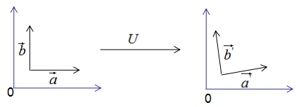

# SVD分解

- [SVD分解](#svd分解)
  - [前言](#前言)
    - [1.正交变换](#1正交变换)
    - [2.特征值分解含义](#2特征值分解含义)
    - [3. 奇异值分解](#3-奇异值分解)
    - [4. 行降维和列降维](#4-行降维和列降维)
    - [5. 数据压缩](#5-数据压缩)
    - [6. SVD总结](#6-svd总结)

---
## 前言
奇异值分解（Singular Value Decomposition, SVD）在降维，数据压缩，推荐系统等有广泛的应用，任何矩阵都可以进行奇异值分解，本文通过正交变换不改变基向量间的夹角循序渐进的推导SVD算法，以及用协方差含义去理解行降维和列降维，最后介绍SVD的数据压缩原理。

---
### 1.正交变换
正交变换公式：

$$
X = UY
$$

上式表示：$X$是$Y$的正交变换，其中$U$为正交矩阵，$X$和$Y$为列向量。

下面用一个例子说明正交变换的含义：

假设有两个单位列向量$a$和$b$，两向量的夹角为$\theta$，如下图：

现对向量$a$，$b$进行正交变换：

$$
\begin{array}{l}
\vec{a}=U * \vec{a} \\
\vec{b}=U * \vec{b}
\end{array}
$$

$\vec{a}$,$\vec{b}$的模：

$$
\begin{array}{l}
\|\overrightarrow{a^{\prime}}\|=\|U^{*} \vec{a}\|=\|U\|^{*}\|\vec{a}\|=\|\vec{a}\|=1 \\
\|\overrightarrow{b^{\prime}}\|=\|U^{*} \vec{b}\|=\|U\|^{*}\|\vec{b}\|=\|\vec{b}\|=1
\end{array}
$$

由上式可知$\|\overrightarrow{a^{\prime}}\|$, $\|\overrightarrow{b^{\prime}}\|$的模都为1.

$\overrightarrow{a^{\prime}}$,$\overrightarrow{b^{\prime}}$的内积：

$$
\begin{array}{l}
\overrightarrow{a^{\prime}} * \overrightarrow{b^{\prime}}=\left(U * \vec{a}\right)^{T}  * (U * \vec{b})=\vec{a}^{T} U^{T} U \vec{b} \\
\Longrightarrow \overrightarrow{a^{\prime}} * \overrightarrow{b^{\prime}} = \vec{a}^{T} * \vec{b}
\end{array}
$$

由上式可知，正交变换前后的内积相等。

$\overrightarrow{a^{\prime}}$,$\overrightarrow{b^{\prime}}$的夹角$\theta^{\prime}$：

$$
\begin{array}{l}
\cos \theta^{\prime}=\frac{\vec{a^{\prime}}^{T} * \vec{b^{\prime}}}{\left\|\vec{a^{\prime}}\right\| * \left\|\vec{b^{\prime}}\right\|} \\[1em]
\cos \theta=\frac{\vec{a}^{T} * \vec{b}}{\left\|\vec{a}\right\| * \left\|\vec{b}\right\|}
\end{array}
$$

由上式可知，正交变换前后的夹角相等。

因此，正交变换的性质可用下图来表示：

**正交变换的两个重要性质**：

- 正交变换不改变向量的模
- 正交变换不改变向量间的夹角

如果向量$\vec{a}$和$\vec{b}$是基向量，那么正交变换的结果如下图所示：

上图可以得到重要结论：**基向量正交变换后的结果仍为基向量**。基向量是表示向量最简洁的方法，向量在基向量的投影就是所在基向量的坐标，我们通过这种思想去理解特征值分解和推导SVD分解。

---
### 2.特征值分解含义

对称方阵A的特征值分解为：

$$
A = U \Sigma U^{-1}
$$

其中$U$为正交矩阵，$\Sigma$为对角矩阵，对角线上的元素为特征值。

为了可视化特征值分解，假设A是$2 \times 2$的对称矩阵，$U = (u_{1}, u_{2})$， $\Sigma = (\lambda_{1}, \lambda_{2})$。上式展开为：

$$
\begin{array}{l}
A u_{1} = \lambda_{1} u_{1} \\
A u_{2} = \lambda_{2} u_{2}
\end{array}
$$

用图形表示为：

由上图可知，矩阵A没有旋转特征向量，它只是对特征向量进行了拉伸或缩短（取决于特征值的大小），因此，对称矩阵对其特征向量（基向量）的变换仍然是基向量（单位化） 。

特征向量和特征值的几何意义：若向量经过矩阵变换后保持方向不变，只是进行长度上的伸缩，那么该向量是矩阵的特征向量，伸缩倍数是特征值。

---
### 3. 奇异值分解

我们考虑了当基向量是对称矩阵的特征向量时，矩阵变换后仍是基向量，**但是，我们在实际项目中遇到的大都是行和列不相等的矩阵**，如统计每个学生的科目乘积，行数为学生个数，列数为科目数，这种形成的矩阵很难是方阵，**因此SVD分解是更普遍的矩阵分解方法**。

先回顾一下正交变换的思想：基向量正交变换后的结果仍为基向量。

我们用正交变换的思路来推导SVD分解：

假设$A$是$M*N$的矩阵，秩为$K$，$Rank(A)=k$

存在一组正交基V：

$$
V = (v_1, v_2, \ldots, v_k)
$$

矩阵对其变换后仍是正交基，记为$U$：

$$
U = (Av_1, Av_2, \ldots, Av_k)
$$

由正交基定义，得：

$$
(Av_i)^T(Av_j) = 0, i \neq j
$$

上式展开：

$$
v_i^T A^T A v_j = 0, i \neq j
$$

当$v_i$是$A^{T}A$的特征值时，有：

$$
A^{T}A v_i = \lambda_i v_i
$$

将上式代入上式展开式，得：

$$
\lambda_i v_i^T v_j = 0, i \neq j
$$

即假设成立。

图像表示如下：

正交向量的模：

$$
\begin{array}{l}
\|A v_i \|^2 = (A v_i)^{T} * (A v_i) \\[1em]
\Longrightarrow \|A v_i \|^2 = v_i^{T} A^{T} A v_i \\[1em]
\Longrightarrow \|A v_i \|^2 = \lambda_i v_i^{T} v_i  = \lambda_i \\[1em]
\therefore \|A v_i \| = \sqrt{\lambda_i}
\end{array}
$$

单位化正交向量，得：

$$
\begin{array}{l}
u_i = \frac{A v_i}{\|A v_i \|} = \frac{1}{\sqrt{\lambda_i}} A v_i \\[1em]
\Longrightarrow A v_i = \sqrt{\lambda_i}  * u_i    
\end{array}
$$

**结论：当基向量是$A^{T}A$的特征向量时，矩阵A转换后的向量也是基向量**

用矩阵形式表示上式：

$$
AV = U \Sigma \tag{1}
$$

其中：

$$
V = (v_1, v_2, \ldots, v_k), \Sigma = diag(\sqrt{\lambda_1}, \sqrt{\lambda_2}, \ldots, \sqrt{\lambda_k}), U = (u_1, u_2, \ldots, u_k)
$$

$V$是$N*K$矩阵，$U$是$M*K$矩阵，$\Sigma$是$K*K$矩阵，需要扩展成方阵形式：

将正交基$U = (u_1, u_2, \ldots, u_k)$扩展成$(u_1, u_2, \ldots, u_M)R^{M}$空间的正交基，即$U$是$M * M$方阵。
将正交基$V = (v_1, v_2, \ldots, v_k)$扩展成$(v_1, v_2, \ldots, v_n)R^{n}$空间的正交基，其中$(v_{k+1}, v_{k+2}, \ldots, v_n)$是矩阵A的零空间，即：

$$
A v_i = 0, i > k
$$

对应的特征值$\sigma_i=0$，$\Sigma$是$M * N$对角矩阵，$V$是$N * N$方阵。

因此式$(1)$写成向量形式为：

$$
A(v_1, v_2, \ldots, v_k | v_{k+1}, v_{k+2}, \ldots, v_{N}) = (u_1, u_2, \ldots, u_k | u_{k+1}, u_{k+2}, \ldots, u_M) \left(\begin{array}{cccccc}
\sigma_1 & 0        & \ldots & 0         & \ldots & 0 \\
0        & \sigma_2 & \ldots & 0         & \ldots & 0 \\
\vdots   & \vdots   & \ddots & \vdots    & \ldots & \vdots \\
0        & 0        & \ldots & \sigma_k  & \ldots & 0 \\
0        & 0        & \ldots & 0         & \ldots & 0 \\
\vdots   & \vdots   & \ldots & \vdots    & \ddots & \vdots \\
0        & 0        & \ldots & 0         & \ldots & 0 \\
\end{array}\right)
$$

得：

$$
AV = U \Sigma
$$

两式右乘$V^{T}$，可得矩阵的奇异值分解：

$$
A = U \Sigma V^{T} \tag{2}
$$

式$(2)$是矩阵的奇异值分解，其中$U$是$M * M$正交矩阵，$\Sigma$是$M * N$对角矩阵，$V$是$N * N$正交矩阵。

写成向量形式为：

$$
\begin{aligned}
    A & = (u_1, u_2, \ldots, u_k | u_{k+1}, u_{k+2}, \ldots, u_{M}) \left(\begin{array}{cccccc}
    \sigma_1 & 0        & \ldots & 0         & \ldots & 0 \\
    0        & \sigma_2 & \ldots & 0         & \ldots & 0 \\
    \vdots   & \vdots   & \ddots & \vdots    & \ldots & \vdots \\
    0        & 0        & \ldots & \sigma_k  & \ldots & 0 \\
    0        & 0        & \ldots & 0         & \ldots & 0 \\
    \vdots   & \vdots   & \ldots & \vdots    & \ddots & \vdots \\
    0        & 0        & \ldots & 0         & \ldots & 0 \\
    \end{array}\right) (v_1, v_2, \ldots, v_{k} | v_{k+1}, \ldots, v_N)^{T} \\
    & = (u_1, u_2, \ldots, u_k) \left(\begin{array}{cccc}
    \sigma_1 & 0        & \ldots & 0   \\
    0        & \sigma_2 & \ldots & 0   \\
    \vdots   & \vdots   & \ddots & \vdots    \\
    0        & 0        & \ldots & \sigma_k  \\
    \end{array}\right) (v_1, v_2, \ldots, v_{k})^{T} \\
    & = \sum_{i=1}^{k} \sigma_i u_i v_i^{T}
\end{aligned}
$$

令：

$$
\begin{aligned}
    X & = (u_1, u_2, \ldots, u_k) \left(\begin{array}{cccc}
    \sigma_1 & 0        & \ldots & 0   \\
    0        & \sigma_2 & \ldots & 0   \\
    \vdots   & \vdots   & \ddots & \vdots    \\
    0        & 0        & \ldots & \sigma_k  \\
    \end{array}\right) = (\sigma_1 u_1, \sigma_2 u_2, \ldots, \sigma_k u_k) \\
    Y & = (v_1, v_2, \ldots, v_{k})^{T}
\end{aligned}
$$

则：

$$
A = X Y^{T}
$$

因为$X$和$Y$分别是列满秩和行满秩矩阵，所以上式是A的满秩分解。

(2)式的奇异值矩阵$\Sigma$的值$\sigma_i$是$A^{T}A$特征值的平方根，下面推导奇异值分解的$U$和$V$:

$$
\begin{aligned}
A^{T} A & = (U \Sigma V^{T})^{T} (U \Sigma V^{T}) \\
& = V \Sigma^{T} U^{T} U \Sigma V^{T} \\
& = V \Sigma^{2} V^{T}
\end{aligned}
$$

即$V$是$A^{T}A$的特征向量构成的矩阵，称为右奇异矩阵。

$$
\begin{aligned}
A A^{T} & = (U \Sigma V^{T}) (U \Sigma V^{T})^{T} \\
& = U \Sigma V^{T} V \Sigma^{T} U^{T} \\
& = U \Sigma^{2} U^{T}
\end{aligned}
$$

即$U$是$A A^{T}$的特征向量构成的矩阵，称为左奇异矩阵。

**小结：**

矩阵A的奇异值分解：

$$
A = U \Sigma V^{T}
$$

其中$U$是$A A^{T}$的特征向量构成的矩阵，$V$是$A^{T} A$的特征向量构成的矩阵，奇异值矩阵$\Sigma$的值为$A^{T} A$特征值的平方根。

---
### 4. 行降维和列降维

本节通过协方差的角度去理解行降维和列降维。首先探讨下协方差的含义：

单个变量用方差描述，无偏方差公式：

$$
D(x) = \frac{1}{n-1} \sum_{i=1}^{n} (x_i - \bar{x})^2
$$

其中$n$为样本个数，$\bar{x}=\frac{1}{n}\Sigma^{n}_{i=1}x_i$为样本均值。

两个变量用协方差描述，无偏协方差公式：

$$
cov(x, y) = \frac{1}{n-1} \sum_{i=1}^{n} (x_i - \bar{x})(y_i - \bar{y})
$$

多个变量(如三个变量)之间的关系可以用协方差矩阵描述：

$$
cov(x, y, z)  = \left(\begin{array}{lll}
cov(x_1, x_1) & cov(x_1, x_2) & cov(x_1, x_3) \\
cov(x_2, x_1) & cov(x_2, x_2) & cov(x_2, x_3) \\
cov(x_3, x_1) & cov(x_3, x_2) & cov(x_3, x_3) \\
\end{array}\right)
$$

相关系数公式：

$$
\rho_{xy} = \frac{cov(x, y)}{\sqrt{D(x) D(y)}}
$$

由上式可知，协方差是描述变量之间的相关关系程度：

- 协方差$cov(x, y) > 0$时，变量$x$与$y$正相关；
- 协方差$cov(x, y) < 0$时，变量$x$与$y$负相关；
- 协方差$cov(x, y) = 0$时，变量$x$与$y$不相关。

变量与协方差关系的定性分析图：

现在开始讨论$A^{T}A$和$AA^{T}$的含义：

假设数据集是$n$维的，共有$m$个样本，每一行表示一例数据，即：

$$
A = \left(\begin{array}{c}
(x^{(1)})^{T} \\
(x^{(2)})^{T} \\
\vdots \\
(x^{(m)})^{T}
\end{array}\right)
$$

其中$x^{(i)}$是第$i$个样本，$X_j$表示第$j$维特征，$x^{(i)}_{j}$表示第$i$个样本的第$j$维特征。

$$
\begin{aligned}
    & A^{T}A = (x^{(1)}, x^{(2)}, \ldots, x^{(m)}) \left(\begin{array}{c}
    (x^{(1)})^{T} \\
    (x^{(2)})^{T} \\
    \vdots \\
    (x^{(m)})^{T}
    \end{array}\right) = x^{(1)}(x^{(1)})^{T} + x^{(2)}(x^{(2)})^{T} + \ldots + x^{(m)}(x^{(m)})^{T} \\
    & \Longrightarrow A^{T}A = \left(\begin{array}{cccc}
    cov(x_1, x_1), & cov(x_1, x_2), & \ldots, & cov(x_1, x_n) \\
    cov(x_2, x_1), & cov(x_2, x_2), & \ldots, & cov(x_2, x_n) \\
    \vdots         & \vdots         & \ddots  & \vdots        \\
    cov(x_n, x_1), & cov(x_n, x_2), & \ldots, & cov(x_n, x_n) \\
    \end{array}\right)
\end{aligned}
$$

由上式可知，$A^{T}A$是描述各特征间相关关系的矩阵，所以$A^{T}A$的正交基$V$是以数据集的特征空间进行展开的。

数据集$A$在特征空间展开为:

$$
X_{M * N} = A_{M * N}V_{N * N}
$$

特征值表示了$A^{T}A$在相应特征向量的信息分量。特征值越大，包含矩阵$A^{T}A$的信息分量亦越大。

若我们选择前$r$个特征值来表示原始数据集，数据集$A$在特征空间展开为:

$$
X^{\prime}_{M * r} = A_{M * N}V_{N * r}
$$

上式对列进行了降维，即右奇异矩阵$V$可以用于列数的压缩，与PCA降维算法一致。

行降维：

$$
\begin{aligned}
& A A^{T} = \left(\begin{array}{l}
    (x^{(1)})^{T} \\
    (x^{(2)})^{T} \\
    \vdots \\
    (x^{(m)})^{T}
    \end{array}\right) (x^{(1)}, x^{(2)}, \ldots, x^{(m)}) =\left(\begin{array}{cccc}
    (x^{(1)})^{T} x^{(1)} & (x^{(1)})^{T} x^{(2)} & \ldots & (x^{(1)})^{T} x^{(m)} \\
    (x^{(2)})^{T} x^{(1)} & (x^{(2)})^{T} x^{(2)} & \ldots & (x^{(2)})^{T} x^{(m)} \\
    \vdots                & \vdots                & \ddots & \vdots                \\
    (x^{(m)})^{T} x^{(1)} & (x^{(m)})^{T} x^{(2)} & \ldots & (x^{(m)})^{T} x^{(m)} \\
    \end{array}\right) \\[3em]
& \Longrightarrow A A^{T} = \left(\begin{array}{cccc}
cov(x^{(1)}, x^{(1)}), & cov(x^{(1)}, x^{(2)}), & \ldots, & cov(x^{(1)}, x^{(m)}) \\
cov(x^{(2)}, x^{(1)}), & cov(x^{(2)}, x^{(2)}), & \ldots, & cov(x^{(2)}, x^{(m)}) \\
\vdots                & \vdots                & \ddots  & \vdots                \\
cov(x^{(m)}, x^{(1)}), & cov(x^{(m)}, x^{(2)}), & \ldots, & cov(x^{(m)}, x^{(m)}) \\   
\end{array} \right)
\end{aligned}
$$

由上式可知，$A A^{T}$是描述样本数据间相关关系的矩阵，因此左奇异矩阵$U$是以样本空间进行展开的，原理与列降维一致。

若我们选择前$r$个特征值来表示原始数据集，数据集$A$在特征空间展开为:

$$
Y_{r * N} = U^{T}_{r*M} A_{M * N}
$$

因此，上式实现了行降维，即左奇异矩阵可以用于行数的压缩。

---
### 5. 数据压缩

本节介绍两种数据压缩方法：满秩分解和近似分解

矩阵$A$的秩为$k$，$A$的满秩分解为：

$$
A_{M * N} = X_{M * K} Y_{K * N}
$$

满秩分解图形如下：

由上图可知，存储$X$和$Y$的矩阵比存储$A$矩阵占用的空间小，因此满秩分解实现了数据压缩。

若对数据再次进行压缩，需要用到矩阵的近似分解。

矩阵$A$的奇异值分解：

$$
A_{M * N} = U_{M * M} \Sigma_{M * N} V^{T}_{N * N}
$$

若我们选择前$r$个特征值来近似矩阵$A$，得:

$$
A_{M * N} \approx U_{M * r} \Sigma_{r * r} V^{T}_{r * N}
$$

如下图：

---
### 6. SVD总结

**任何矩阵都能进行SVD分解**，SVD可以用于行降维和列降维，SVD在数据压缩、推荐系统和语义分析有广泛的应用，SVD与PCA的缺点一样，分解出的矩阵解释性不强 。

