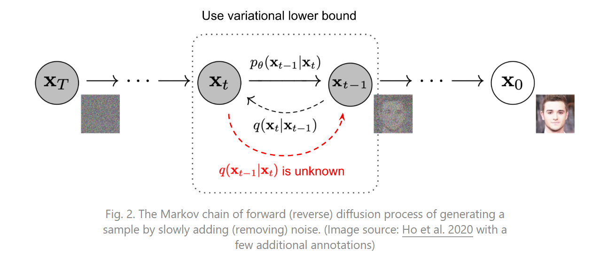

# Diffusion Model
Diffusion Model和其他生成模型最大的区别是它的latent code(z)和原图是同尺寸大小的，当然最近也有基于压缩的latent diffusion model。一句话概括diffusion model，即存在一系列高斯噪声($T$轮)，将输入图片$x_{0}$变为纯高斯噪声$x_{T}$。而我们的模型则负责将$x_{T}$复原回图片$x_{0}$。这样一来其实diffusion model和GAN很像，都是给定噪声$x_{T}$生成图片$x_{0}$，但是要强调的是，这里的$x_{T}$与图片$x_{0}$是**同维度**的。

## DDPM原理
### Diffusion前向过程

所谓前向过程，即往图片上加噪声的过程。虽然这个步骤无法做到图片生成，但是这是理解diffusion model以及**构建训练样本GT**至关重要的一步。

给定真实图片$\mathbf{x}_{0} \sim q\left(\mathbf{x}\right)$，diffusion前向过程通过$\mathbin{T}$次累计对其添加高斯噪声，得到$\mathbf{x}_{1}, \mathbf{x}_{2}, \ldots, \mathbf{x}_{T}$，如下图的$q$过程。这里需要给定一系列的高斯分布方差的超参数$\{\beta_{t} \in \left(0, 1\right)\}_{t=1}^{T}$。前向过程由于每个时刻$t$只与$t-1$时刻有关，所以也可以看做马尔科夫过程：

$$
q\left(\mathbf{x}_{t} \mid \mathbf{x}_{t-1}\right) = \mathcal{N}\left(\mathbf{x}_{t}; \sqrt{1-\beta_{t}}\mathbf{x}_{t-1}, \beta_{t}\mathbf{I}\right) \qquad q\left(\mathbf{x}_{1:T} \mid \mathbf{x}_{0}\right) = \prod_{t=1}^{T}q\left(\mathbf{x}_{t} \mid \mathbf{x}_{t-1}\right)
\tag{1}
$$

这个过程中，随着$t$的增大，$\mathbf{x}_{t}$越来越接近纯噪声。当$T \rightarrow \infin$，$\mathbf{x}_{T}$是完全的高斯噪声(下面会证明，且与均值$\sqrt{1-\beta_{t}}$的选择有关)。且实际中$\beta_{t}$随着$t$增大是递增的，即$\beta_{1} \lt \beta_{2} \lt \ldots \lt \beta_{T}$。在GLIDE的code中，$\beta_{t}$是由0.0001到0.02线性插值(以$\mathcal{T}=1000$为基准，$\mathcal{T}$增加，$\beta_{T}$对应降低)。

---

前向过程结束介绍前，需要讲述一下diffusion在实现和推导过程中要用到的两个重要特征。

#### 特性1：重参数(reparameterization trick)
重参数技巧在很多工作(Gumbel Softmax, VAE)中有所引用。如果我们要从某个分布中随机采样(高斯分布)一个样本，这个过程是无法反传梯度的。而这个通过高斯噪声采样得到的$\mathbf{x}_{t}$的过程在diffusion中到处都是，因此我们需要通过重参数技巧来使得它可微。最通常的做法是把随机性通过一个独立的随机变量($\epsilon$)引导过去。举个例子，如果要从高斯分布$z \sim \mathcal{N}\left(z; \mu_{\theta}, \sigma_{\theta}^{2}\mathbf{I}\right)$采样一个$z$，我们可以写成：

$$
z = \mu_{\theta} + \sigma_{\theta} \odot \epsilon, \quad \epsilon \sim \mathcal{N}\left(0, \mathbf{I}\right)
$$

上式的$z$依旧是有随机性的，且满足均值为$\mu_{\theta}$方差为$\sigma_{\theta}^{2}$的高斯分布。这里的$\mu_{\theta}$，$\sigma_{\theta}^{2}$可以是由参数$\theta$的神经网络推断得到的。整个“采样”过程依旧梯度可导，随机性被转嫁到了$\epsilon$上。

#### 特性2：任意时刻的$\mathbf{x}_{t}$可以由$\mathbf{x}_{0}$和$\beta$表示
能够通过$\mathbf{x}_{0}$和$\beta$快速得到$\mathbf{x}_{t}$，对后续diffusion model的推断和推导有巨大作用。首先我们假设$\alpha_{t} = 1 - \beta_{t}$，并且$\bar{\alpha_{t}}=\prod_{i=1}^{T}\alpha_{i}$，由式$(1)$展开$\mathbf{x}_{t}$可以得到：

$$
\begin{aligned}
\mathbf{x}_{t} & = \sqrt{1-\beta_{t}}\mathbf{x}_{t-1} + \beta_{t}\epsilon_{t-1} \quad \text{ where } \epsilon_{t-1}, \epsilon_{t-2}, \ldots \sim \mathcal{N}(0, \mathbf{I})\\
& =\sqrt{\alpha_{t}}\mathbf{x}_{t-1} + \sqrt{1-\alpha_{t}}\epsilon_{t-1} \\
& =\sqrt{\alpha_{t}}\left(\sqrt{\alpha_{t-1}}\mathbf{x}_{t-2} + \sqrt{1-\alpha_{t-1}}\epsilon_{t-2}\right) + \sqrt{1-\alpha_{t}}\epsilon_{t-1} \\
& =\sqrt{\alpha_{t}\alpha_{t-1}}\mathbf{x}_{t-2} + \left(\sqrt{\alpha_{t}\left(1-\alpha_{t-1}\right)}\epsilon_{t-2} + \sqrt{1-\alpha_{t}}\epsilon_{t-1}\right) \\
& =\sqrt{\alpha_{t} \alpha_{t-1}}\mathbf{x}_{t-2} + \sqrt{1-\alpha_{t}\alpha_{t-1}}\bar{\epsilon}_{t-2} \quad \text {where } \bar{\epsilon}_{t-2} \sim \mathcal{N}(0, \mathbf{I})  \text{ mergs two Gaussion$\left(*\right)$}\\
& =\ldots \\
& =\sqrt{\bar{\alpha}_{t}}\mathbf{x}_{0} + \sqrt{1-\bar{\alpha}_{t}}\epsilon. \\
q\left(\mathbf{x}_{t} \mid \mathbf{x}_{0}\right) & = \mathcal{N}\left(\mathbf{x}_{t}; \sqrt{\bar{\alpha_{t}}}\mathbf{x}_{0}, \left(1-\bar{\alpha_{t}}\right)\mathbf{I}\right).
\tag{2}
\end{aligned}
$$

由于独立高斯分布的可加性，即$\mathcal{N}\left(0, \sigma_{1}^{2}\right) + \mathcal{N}\left(0, \sigma_{2}^{2}\right) \sim \mathcal{N}\left(0, \left(\sigma_{1}^{2} + \sigma_{2}^{2} \right)\right)$，所以

$$
\begin{aligned}
    & \sqrt{\alpha_{t}\left(1-\alpha_{t-1}\right)}\epsilon_{t-2} \sim \mathcal{0, \alpha_{t}\left(1-\alpha_{t-1}\right)\mathbf{I}}, \\
    & \sqrt{1-\alpha_{t}}\epsilon_{t-1} \sim \mathcal{N}\left(0, \left(1-\alpha_{t}\right)\mathbf{I}\right), \\
    & \sqrt{\alpha_{t}\left(1-\alpha_{t-1}\right)}\epsilon_{t-2} + \sqrt{1-\alpha_{t}}\epsilon_{t-1} \sim \mathcal{N}\left(0, \left[\alpha_{t}\left(1-\alpha_{t-1}\right) + \left(1-\alpha_{t}\right)\right]\mathbf{I}\right) \\
    & = \mathcal{N}\left(0, \left(1-\alpha_{t}\alpha_{t-1}\right)\mathbf{I}\right). \tag{3}
\end{aligned}
$$

因此可以混合两个高斯分布得到标准差为$\sqrt{1-\alpha_{t}\alpha_{t-1}}$的混合高斯分布，式$(2)$中的$\bar{\epsilon_{t-2}}$仍然是标准高斯分布。而任意时刻的$\mathbf{x}_{t}$满足$q\left(\mathbf{x}_{t} \mid \mathbf{x}_{0}\right) = \mathcal{N}\left(\mathbf{x}_{t}; \sqrt{\bar{\alpha_{t}}}\mathbf{x}_{0}, \left(1-\bar{\alpha_{t}}\right)\mathbf{I}\right)$.

通过$Eq(2)$、$(3)$，可以发现当$\mathbin{T} \rightarrow \infin, \mathbf{x}_{T} \sim \mathcal{N}\left(0, \mathbf{I}\right)$，所以$\sqrt{1-\beta_{t}}$的均值系数能够稳定保证$\mathbf{x}_{T}$最后收敛到方差为1的保准高斯分布，且在$Eq(3)$的推导中也更为简洁优雅。

---

### Diffusion逆向(推断)过程

如果说前向过程(forward)是加噪的过程，那么逆向过程(reverse)就是diffusion的去噪推断过程。如果我们能够逐步得到逆转后的分布$q\left(\mathbf{x}_{t-1} \mid \mathbf{x}_{t}\right)$，就可以从标准的高斯分布$\mathbf{x}_{T} \sim \mathbf{N}\left(0, \mathbf{I}\right)$还原出原图$\mathbf{x}_{0}$。在文献[1]中证明了如果$q\left(\mathbf{x}_{t} \mid \mathbf{x}_{t-1}\right)$满足高斯分布且$\beta_{t}$足够小，$q\left(\mathbf{x}_{t-1} \mid \mathbf{x}_{t}\right)$仍然是一个高斯分布。然而我们无法简单推断$q\left(\mathbf{x}_{t-1} \mid \mathbf{x}_{t}\right)$，因此我们使用深度学习模型(参数为$\theta$，目前主流是U-Net+Attention的结构)去预测这样一个逆向分布$p_{\theta}$(类似VAE)：

$$
\begin{aligned}
    p_{\theta}\left(\mathbin{X}_{0:T}\right) & = p\left(\mathbf{x}_{T}\right)\prod_{t=1}^{T}p_{\theta}\left(\mathbf{x}_{t-1} \mid \mathbf{x}_{t}\right);  \\
    p_{\theta}\left(\mathbf{x}_{t-1} \mid \mathbf{x}_{t}\right) & = \mathcal{N}\left(\mathbf{x}_{t-1}; \boldsymbol{\mu}_{\theta}\left(\mathbf{x}_{t}, t\right), \boldsymbol{\Sigma}_{\theta}\left(\mathbf{x}_{t}, t\right)\right).
\end{aligned}
$$

虽然我们无法得到逆转后的分布$q\left(\mathbf{x}_{t-1} \mid \mathbf{x}_{t}\right)$，但是如果知道$\mathbf{x}_{0}$，我们是可以通过贝叶斯公式得到$q\left(\mathbf{x}_{t-1} \mid \mathbf{x}_{t}, \mathbf{x}_{0}\right)$为：

$$
q\left(\mathbf{x}_{t-1} \mid \mathbf{x}_{t}, \mathbf{x}_{0}\right) = \mathcal{N}\left(\mathbf{x}_{t-1}; \tilde{\mu}\left(\mathbf{x}_{t}, \mathbf{x}_{0}\right), \tilde{\beta_{t}}\mathbf{I}\right)
$$

过程如下：

$$
\begin{aligned}
    q\left(\mathbf{x}_{t-1} \mid \mathbf{x}_{t}, \mathbf{x}_{0}\right) & = \frac{q\left(\mathbf{x}_{t-1}, \mathbf{x}_{t}, \mathbf{x}_{0}\right)}{q\left(\mathbf{x}_{t}, \mathbf{x}_{0}\right)} \\
    & = \frac{q\left(\mathbf{x}_{0}\right) q\left(\mathbf{x}_{t-1} \mid \mathbf{x}_{0} \right) q\left(\mathbf{x}_{t} \mid \mathbf{x}_{t-1}, \mathbf{x}_{0}\right)}{q\left(\mathbf{x}_{t}, \mathbf{x}_{0}\right)} \\
    & = \frac{q\left(\mathbf{x}_{0}\right) q\left(\mathbf{x}_{t-1} \mid \mathbf{x}_{0} \right) q\left(\mathbf{x}_{t} \mid \mathbf{x}_{t-1}, \mathbf{x}_{0}\right)}{q\left(\mathbf{x}_{0}\right) q\left(\mathbf{x}_{t} \mid \mathbf{x}_{0}\right)} \\
    & = \frac{q\left(\mathbf{x}_{t-1} \mid \mathbf{x}_{0} \right) q\left(\mathbf{x}_{t} \mid \mathbf{x}_{t-1}, \mathbf{x}_{0}\right)}{q\left(\mathbf{x}_{t} \mid \mathbf{x}_{0}\right)} \\
    & = \frac{q\left(\mathbf{x}_{t-1} \mid \mathbf{x}_{0} \right) q\left(\mathbf{x}_{t} \mid \mathbf{x}_{t-1}\right)}{q\left(\mathbf{x}_{t} \mid \mathbf{x}_{0}\right)} \quad \text{由于$\mathbf{x}_{t-1} \rightarrow \mathbf{x}_{t}$与$\mathbf{x}_{0}$无关，因此可进行等价替换} \\
    & = q\left(\mathbf{x}_{t} \mid \mathbf{x}_{t-1}\right)\frac{q\left(\mathbf{x}_{t-1} \mid \mathbf{x}_{0} \right)}{q\left(\mathbf{x}_{t} \mid \mathbf{x}_{0}\right)} \\
    & \propto \exp \left(-\frac{1}{2}\left(\frac{\left(\mathbf{x}_{t}-\sqrt{\alpha_{t}} \mathbf{x}_{t-1}\right)^{2}}{\beta_{t}} + \frac{\left(\mathbf{x}_{t-1}-\sqrt{\bar{\alpha}_{t-1}} \mathbf{x}_{0}\right)^{2}}{1-\bar{\alpha}_{t-1}} - \frac{\left(\mathbf{x}_{t}-\sqrt{\bar{\alpha}_{t}} \mathbf{x}_{0}\right)^{2}}{1-\bar{\alpha}_{t}}\right)\right) \\
    & =\exp \left(-\frac{1}{2}\left(\frac{\mathbf{x}_{t}^{2}-2 \sqrt{\alpha_{t}} \mathbf{x}_{t} \mathbf{x}_{t-1}+\alpha_{t} \mathbf{x}_{t-1}^{2}}{\beta_{t}}+\frac{\mathbf{x}_{t-1}^{2}-2 \sqrt{\bar{\alpha}_{t-1}} \mathbf{x}_{0} \mathbf{x}_{t-1}+\bar{\alpha}_{t-1} \mathbf{x}_{0}^{2}}{1-\bar{\alpha}_{t-1}}-\frac{\left(\mathbf{x}_{t}-\sqrt{\bar{\alpha}_{t}} \mathbf{x}_{0}\right)^{2}}{1-\bar{\alpha}_{t}}\right)\right) \\
    & = \exp \left(-\frac{1}{2}(\underbrace{\left(\frac{\alpha_{t}}{\beta_{t}}+\frac{1}{1-\bar{\alpha}_{t-1}}\right) \mathbf{x}_{t-1}^{2}}_{\mathbf{x}_{t-1} \text { 方差 }}-\underbrace{\left(\frac{2 \sqrt{\alpha_{t}}}{\beta_{t}} \mathbf{x}_{t}+\frac{2 \sqrt{\bar{\alpha}_{t-1}}}{1-\bar{\alpha}_{t-1}} \mathbf{x}_{0}\right) \mathbf{x}_{t-1}}_{x_{t-1} \text { 均值 }}+\underbrace{C\left(\mathbf{x}_{t}, \mathbf{x}_{0}\right)}_{\text {与 } x_{t-1} \text { 方关 }})\right) .
\end{aligned}
$$

由特性2：任意时刻的$\mathbf{x}_{t}$可以由$\mathbf{x}_{0}$和$\beta$表示，$\mathbf{x}_{t} = \sqrt{\bar{\alpha_{t}}}\mathbf{x}_{0} + \sqrt{1-\bar{\alpha_{t}}}\epsilon_{t}, \quad \epsilon \sim \mathcal{N}\left(0, \mathbf{I}\right)$可得：

$$
\left\{
    \begin{aligned}
    & \mathbf{x}_{t-1} - \sqrt{\bar{\alpha}_{t-1}}\mathbf{x}_{0} \sim \mathcal{N}\left(0, \left(1-\bar{\alpha}_{t-1}\right)\mathbf{I}\right) \\
    & \mathbf{x}_{t} - \sqrt{\bar{\alpha}_{t}}\mathbf{x}_{0} \sim \mathcal{N}\left(0, \left(1-\bar{\alpha_{t}}\right)\mathbf{I}\right)
    \end{aligned}
\right.
$$

上述过程巧妙地将**逆向**过程全部变回了**前向**过程，即$\left(\mathbf{x}_{t-1}, \mathbf{x}_{0}\right) \rightarrow \mathbf{x}_{t}; \quad \mathbf{x}_{0} \rightarrow \mathbf{x}_{t}; \quad \mathbf{x}_{0} \rightarrow \mathbf{x}_{t-1}$. 且$\mathcal{N}\left(\mu, \sigma^{2}\right)= \exp \left(-\frac{(x-\mu)^2}{2\sigma^2}\right) = \exp \left(-\frac{1}{2}\left(\frac{1}{\sigma^2}x^2 - \frac{2\mu}{\sigma^2}x + \frac{\mu^2}{\sigma^2}\right)\right)$，因此上式最终可整理成高斯分布概率密度函数形式。稍加整理我们可以得到$q\left(\mathbf{x}_{t-1} \mid \mathbf{x}_{t}, \mathbf{x}_{0}\right) = \mathcal{N}\left(\mathbf{x}_{t-1}; \tilde{\mu}\left(\mathbf{x}_{t}, \mathbf{x}_{0}\right), \tilde{\beta_{t}}\mathbf{I}\right)$中的方差和均值为：

$$
\begin{aligned}
    & \frac{1}{\sigma^{2}}=\frac{1}{\tilde{\beta}_{t}}=\left(\frac{\alpha_{t}}{\beta_{t}}+\frac{1}{1-\bar{\alpha}_{t-1}}\right) ; \quad \tilde{\beta}_{t}=\frac{1-\bar{\alpha}_{t-1}}{1-\bar{\alpha}_{t}} \cdot \beta_{t} \\
    & \frac{2 \mu}{\sigma^{2}}=\frac{2 \tilde{\mu}_{t}\left(\mathbf{x}_{t}, \mathbf{x}_{0}\right)}{\tilde{\beta}_{t}}=\left(\frac{2 \sqrt{\alpha_{t}}}{\beta_{t}} \mathbf{x}_{t}+\frac{2 \sqrt{\bar{\alpha}_{t-1}}}{1-\bar{\alpha}_{t-1}} \mathbf{x}_{0}\right) ; \\
    & \tilde{\mu}_{t}\left(x_{t}, x_{0}\right)=\frac{{ }_{a_{t}}\left(1-\bar{\alpha}_{t-1}\right)}{1-\bar{\alpha}_{t}} \mathbf{x}_{t}+\frac{\sqrt{\bar{\alpha}_{t-1}} \beta_{t}}{1-\bar{\alpha}_{t}} \mathbf{x}_{0}. \tag{4}
\end{aligned}   
$$

根据特性2，可知$\mathbf{x}_{0} = \frac{1}{\sqrt{\bar{\alpha}_{t}}}\left(\mathbf{x}_{t} - \sqrt{1-\bar{\alpha}_{t}}\right)\epsilon_{t}$，因此代入式$(4)$可得：

$$
\begin{aligned}
    \tilde{\mu}_{t} & = \frac{\sqrt{\alpha_{t}}\left(1-\bar{\alpha}_{t-1}\right)}{1-\bar{\alpha}_{t}}\mathbf{x}_{t} + \frac{\sqrt{\bar{\alpha}_{t-1}}\beta_{t}}{1-\bar{\alpha}_{t}}\frac{1}{\sqrt{\bar{\alpha}_{t}}}\left(\mathbf{x}_{t} - \sqrt{1-\bar{\alpha}_{t}}\epsilon_{t}\right)  \\ 
    & = \frac{1}{\sqrt{\alpha_{t}}}\left(\mathbf{x}_{t} - \frac{\beta_{t}}{\sqrt{1-\bar{\alpha}_{t}}}\epsilon_{t}\right)
\end{aligned}
$$

其中高斯分布$\epsilon_{t}$为深度模型所预测的噪声(用于去噪)，可以看做$\epsilon_{\theta}\left(\mathbf{x}_{t}, t\right)$，即得到：

$$
\mu_{\theta}\left(\mathbf{x}_{t}, t\right) = \frac{1}{\sqrt{\alpha_{t}}}\left(\mathbf{x}_{t} - \frac{\beta_{t}}{\sqrt{1-\bar{\alpha}_{t}}}\epsilon_{\theta}\left(\mathbf{x}_{t}, t\right)\right) \tag{5}
$$

这样一来，DDPM的每一步的推断可以总结为：

(1) 每个时间步通过$\mathbf{x}_{t}$和$t$来预测高斯噪声$\epsilon_{\theta}\left(\mathbf{x}_{t}, t\right)$，随后由式$(5)$得到均值$\mu_{\theta}\left(\mathbf{x}_{t}, t\right)$.  
(2) 得到方差$\boldsymbol{\Sigma}_{\theta}\left(\mathbf{x}_{t}, t\right)$，DDPM中使用untrained $\boldsymbol{\Sigma}_{\theta}\left(\mathbf{x}_{t}, t\right) = \tilde{\beta}_{t}$，且认为$\tilde{\beta}_{t}=\beta_{t}$和$\tilde{\beta}_{t}=\frac{1-\bar{\alpha}_{t-1}}{1-\bar{\alpha}_{t}} \cdot \beta_{t}$结果近似，在GLIDE中则是根据网络预测trainable方差$\boldsymbol{\Sigma}_{\theta}\left(\mathbf{x}_{t}, t\right)$.  
(3) 根据$p_{\theta}\left(\mathbf{x}_{t-1} \mid \mathbf{x}_{t}\right) = \mathcal{N}\left(\mathbf{x}_{t-1}; \boldsymbol{\mu}_{\theta}\left(\mathbf{x}_{t}, t\right), \boldsymbol{\Sigma}_{\theta}\left(\mathbf{x}_{t}, t\right)\right)$得到$q\left(\mathbf{x}_{t-1} \mid \mathbf{x}_{t}\right)$的估计，利用重参数技巧得到$\mathbf{x}_{t-1}$.

### Diffusion训练
搞清楚diffusion的逆向过程之后，我们算是搞清楚diffusion的推断过程了。但是如何训练diffusion model以得到靠谱的$\boldsymbol{\mu}_{\theta}\left(\mathbf{x}_{t}, t\right)$和$\boldsymbol{\Sigma}_{\theta}\left(\mathbf{x}_{t}, t\right)$呢？通过对真实数据分布下，最大化模型预测分布的对数似然，即优化在$\mathbf{x}_{0} \sim q\left(\mathbf{x}_{0}\right)$下的$p_{\theta}\left(\mathbf{x}_{0}\right)$交叉熵:

$$
\mathcal{L} = \mathbb{E}_{q\left(\mathbf{x}_{0}\right)}\left[-\log p_{\theta}\left(\mathbf{x}_{0}\right)\right]. \tag{6}
$$

注意，上述最大化模型预测分布的对数似然意味着：
$$
\begin{aligned}
    & \boldsymbol{max} \quad \mathbb{E}_{q\left(\mathbf{x}_{0}\right)}\left[\log p_{\theta}\left(\mathbf{x}_{0}\right)\right] \\
    \Leftrightarrow \quad & \boldsymbol{min} \quad -\mathbb{E}_{q\left(\mathbf{x}_{0}\right)}\left[\log p_{\theta}\left(\mathbf{x}_{0}\right)\right] \\
    \Leftrightarrow \quad & \boldsymbol{min} \quad \mathbb{E}_{q\left(\mathbf{x}_{0}\right)}\left[-\log p_{\theta}\left(\mathbf{x}_{0}\right)\right]

\end{aligned} 
$$
 
即最小化在$\mathbf{x}_{0} \sim q\left(\mathbf{x}_{0}\right)$下的$p_{\theta}\left(\mathbf{x}_{0}\right)$交叉熵。

从图2可以看出这个过程很像VAE，即可以使用变分下限(Variational Lower Bound, VLB)来优化负对数似然。由于KL散度非负，可得到：

$$
\begin{aligned}
    -\log p_{\theta}\left(\mathbf{x}_{0}\right) & \le -\log p_{\theta}\left(\mathbf{x}_{0}\right) +  D_{\mathrm{KL}}\left(q\left(\mathbf{x}_{1:T} \mid \mathbf{x}_{0}\right) \| p_{\theta}\left(\mathbf{x}_{1:T} \mid \mathbf{x}_{0}\right)\right) \\
    & = - \log p_{\theta}\left(\mathbf{x}_{0}\right) + \mathbb{E}_{q \left(\mathbf{x}_{1:T} \mid \mathbf{x}_{0}\right)} \left[ \log \frac{q \left(\mathbf{x}_{1:T} \mid \mathbf{x}_{0}\right)}{p_{\theta}\left(\mathbf{x}_{0:T}\right) / p_{\theta}\left(\mathbf{x}_{0}\right)}\right]; \quad \text{where } p_{\theta}\left(\mathbf{x}_{1:T} \mid \mathbf{x}_{0}\right) = \frac{p_{\theta}\left(\mathbf{x}_{0:T}\right)}{p_{\theta}\left(\mathbf{x}_{0}\right)} \\
    & = - \log p_{\theta}\left(\mathbf{x}_{0}\right) + \mathbb{E}_{q \left(\mathbf{x}_{1:T} \mid \mathbf{x}_{0}\right)} \left[ \log \frac{q \left(\mathbf{x}_{1:T} \mid \mathbf{x}_{0}\right)}{p_{\theta}\left(\mathbf{x}_{0:T}\right) } + \underbrace{\log p_{\theta}\left(\mathbf{x}_{0}\right)}_{\text{与$q$无关}}\right] \\
    & = \mathbb{E}_{q \left(\mathbf{x}_{1:T} \mid \mathbf{x}_{0}\right)} \left[ \log \frac{q \left(\mathbf{x}_{1:T} \mid \mathbf{x}_{0}\right)}{p_{\theta}\left(\mathbf{x}_{0:T}\right) } \right]. \tag{7}
\end{aligned}
$$

对式$(7)$左右取期望$\mathbb{E}_{q\left(\mathbf{x}_{0}\right)}$，利用重积分中的Fubini定理：

$$
\mathcal{L}_{VLB} = \underbrace{\mathbb{E}_{q\left(\mathbf{x}_{0}\right)}\left(\mathbb{E}_{q\left(\mathbf{x}_{1:T} \mid \mathbf{x}_{0}\right)}\log \frac{q \left(\mathbf{x}_{1:T} \mid \mathbf{x}_{0}\right)}{p_{\theta}\left(\mathbf{x}_{0:T}\right) }\right) = \mathbb{E}_{q \left(\mathbf{x}_{0:T} \right)} \left[ \log \frac{q \left(\mathbf{x}_{1:T} \mid \mathbf{x}_{0}\right)}{p_{\theta}\left(\mathbf{x}_{0:T}\right) } \right]}_{Fubini\text{定理}} \ge  \mathbb{E}_{q\left(\mathbf{x}_{0}\right)}\left[-\log p_{\theta}\left(\mathbf{x}_{0}\right)\right]
$$

因此我们可以通过最小化$\mathcal{L}_{VLB}$来优化目标函数，能够最小化$\mathcal{L}_{VLB}$即可最小化我们的目标函数$(6)$。

---

#### Fubini定理
Fubini定理给出了使用逐次积分的方法计算双重积分的条件。在这些条件下，不仅能够使用逐次积分计算双重积分，而且交换逐次积分的顺序时，积分结果不变。

若  
$$
\int_{A \times B} \left |  f\left(x, y \right) \right | d\left(x, y\right) < \infin, 
$$
其中$A$和$B$都是$\sigma-$有限测度空间，$A \times B$是$A$和$B$的**积可测空间**，$f: A \times B \mapsto \mathbb{C}$是可测函数，那么  
$$
\int_{A}\left(\int_{B} f\left(x, y\right)dy\right)dx = \int_{B}\left(\int_{A} f\left(x, y\right)dx\right)dy = \int_{A \times B} \left |  f\left(x, y \right) \right | d\left(x, y\right),
$$
前二者是在两个测度空间上的逐次积分，但是积分次序不同；第三个是在乘积空间上关于乘积测度的积分。  
特别地，如果$f\left(x, y\right) = h(x)g(y)$，则
$$
\int_{A}h(x)dx\int_{B}g(y)dy = \int_{A \times B}f(x, y)d(x, y).
$$
如果条件中的绝对积分值不是有限，那么上述两个逐次积分的值可能不同。  

Fubini定理一个应用是计算高斯积分：
$$
\int_{-\infin}^{\infin} e^{-\alpha x^2}dx = \sqrt{\frac{\pi}{\alpha}}
$$

#### Jensen不等式
如果$X$是随机变量，$g$是凸函数，则
$$
g(\mathbb{E}\left[ X \right]) \le \mathbb{E}\left[g(X)\right]
$$
等式当且仅当$X$是一个常数或者$g$是线性时成立，这个性质称为Jensen不等式。

---

另一方面，通过Jensen不等式也可以得到一样的目标：

$$
\begin{aligned}
    \mathcal{L} & = \mathbb{E}_{q(\mathbf{x}_{0})}\left[- \log p_{\theta(\mathbf{x}_{0})}\right] \\
    & = - \mathbb{E}_{q(\mathbf{x}_{0})} \log \left(p_{\theta}(\mathbf{x}_{0}) \cdot \underbrace{\int p_{\theta}(\mathbf{x}_{1:T})d\mathbf{x}_{1:T}}_{\text{积分为1}}\right) \\
    & = - \mathbb{E}_{q(\mathbf{x}_{0})} \log \left(\int p_{\theta}(\mathbf{x}_{0:T})d\mathbf{x}_{1:T}\right) \\
    & = - \mathbb{E}_{q(\mathbf{x}_{0})} \log \left(\int q(\mathbf{x}_{1:T} \mid \mathbf{x}_{0}) \frac{p_{\theta}(\mathbf{x}_{0:T})}{q(\mathbf{x}_{1:T} \mid \mathbf{\mathbf{x}_{0}})})d\mathbf{x}_{1:T}\right) \\
    & = - \mathbb{E}_{q(\mathbf{x}_{0})} \log \left(\mathbb{E}_{q(\mathbf{x}_{1:T} \mid \mathbf{x}_{0})} \frac{p_{\theta}(\mathbf{x}_{0:T})}{q\left(\mathbf{x}_{1:T} \mid \mathbf{\mathbf{x}_{0}}\right)}\right) \\
    & \le - \mathbb{E}_{q(\mathbf{x}_{0})}\mathbb{E}_{q(\mathbf{x}_{1:T} \mid \mathbf{x}_{0})}\left[\log \frac{p_{\theta}(\mathbf{x}_{0:T})}{q\left(\mathbf{x}_{1:T} \mid \mathbf{\mathbf{x}_{0}}\right)} \right] \qquad \text{Jensen不等式} \\
    & = - \mathbb{E}_{q(\mathbf{x}_{0:T})} \log \frac{p_{\theta}(\mathbf{x}_{0:T})}{q\left(\mathbf{x}_{1:T} \mid \mathbf{\mathbf{x}_{0}}\right)} \\
    & = \mathbb{E}_{q(\mathbf{x}_{0:T})} \log \frac{q\left(\mathbf{x}_{1:T} \mid \mathbf{\mathbf{x}_{0}}\right)}{p_{\theta}(\mathbf{x}_{0:T})} = \mathcal{L}_{VLB}.
\end{aligned}
$$

进一步对$\mathcal{L}_{VLB}$推导，可以得到熵与多个$KL$散度的累加：
$$
\begin{aligned}
    L_{\mathrm{VLB}} & =\mathbb{E}_{q\left(\mathbf{x}_{0:T}\right)}\left[\log \frac{q\left(\mathbf{x}_{1: T} \mid \mathbf{x}_0\right)}{p_\theta\left(\mathbf{x}_{0: T}\right)}\right] \\
    & =\mathbb{E}_q\left[\log \frac{\prod_{t=1}^T q\left(\mathbf{x}_t \mid \mathbf{x}_{t-1}\right)}{p_\theta\left(\mathbf{x}_T\right) \prod_{t=1}^T p_\theta\left(\mathbf{x}_{t-1} \mid \mathbf{x}_t\right)}\right] \\
    & =\mathbb{E}_q\left[-\log p_\theta\left(\mathbf{x}_T\right)+\sum_{t=1}^T \log \frac{q\left(\mathbf{x}_t \mid \mathbf{x}_{t-1}\right)}{p_\theta\left(\mathbf{x}_{t-1} \mid \mathbf{x}_t\right)}\right] \\
    & =\mathbb{E}_q\left[-\log p_\theta\left(\mathbf{x}_T\right)+\sum_{t=2}^T \log \frac{q\left(\mathbf{x}_t \mid \mathbf{x}_{t-1}\right)}{p_\theta\left(\mathbf{x}_{t-1} \mid \mathbf{x}_t\right)}+\log \frac{q\left(\mathbf{x}_1 \mid \mathbf{x}_0\right)}{p_\theta\left(\mathbf{x}_0 \mid \mathbf{x}_1\right)}\right] \\
    & =\mathbb{E}_q\left[-\log p_\theta\left(\mathbf{x}_T\right)+\sum_{t=2}^T \log \left(\frac{q\left(\mathbf{x}_{t-1} \mid \mathbf{x}_t, \mathbf{x}_0\right)}{p_\theta\left(\mathbf{x}_{t-1} \mid \mathbf{x}_t\right)} \cdot \frac{q\left(\mathbf{x}_t \mid \mathbf{x}_0\right)}{q\left(\mathbf{x}_{t-1} \mid \mathbf{x}_0\right)}\right)+\log \frac{q\left(\mathbf{x}_1 \mid \mathbf{x}_0\right)}{p_\theta\left(\mathbf{x}_0 \mid \mathbf{x}_1\right)}\right] \\
    & =\mathbb{E}_q\left[-\log p_\theta\left(\mathbf{x}_T\right)+\sum_{t=2}^T \log \frac{q\left(\mathbf{x}_{t-1} \mid \mathbf{x}_t, \mathbf{x}_0\right)}{p_\theta\left(\mathbf{x}_{t-1} \mid \mathbf{x}_t\right)}+\sum_{t=2}^T \log \frac{q\left(\mathbf{x}_t \mid \mathbf{x}_0\right)}{q\left(\mathbf{x}_{t-1} \mid \mathbf{x}_0\right)}+\log \frac{q\left(\mathbf{x}_1 \mid \mathbf{x}_0\right)}{p_\theta\left(\mathbf{x}_0 \mid \mathbf{x}_1\right)}\right] \\
    & =\mathbb{E}_q\left[-\log p_\theta\left(\mathbf{x}_T\right)+\sum_{t=2}^T \log \frac{q\left(\mathbf{x}_{t-1} \mid \mathbf{x}_t, \mathbf{x}_0\right)}{p_\theta\left(\mathbf{x}_{t-1} \mid \mathbf{x}_t\right)}+\log \frac{q\left(\mathbf{x}_T \mid \mathbf{x}_0\right)}{q\left(\mathbf{x}_1 \mid \mathbf{x}_0\right)}+\log \frac{q\left(\mathbf{x}_1 \mid \mathbf{x}_0\right)}{p_\theta\left(\mathbf{x}_0 \mid \mathbf{x}_1\right)}\right] \\
    & =\mathbb{E}_q\left[\log \frac{q\left(\mathbf{x}_T \mid \mathbf{x}_0\right)}{p_\theta\left(\mathbf{x}_T\right)}+\sum_{t=2}^T \log \frac{q\left(\mathbf{x}_{t-1} \mid \mathbf{x}_t, \mathbf{x}_0\right)}{p_\theta\left(\mathbf{x}_{t-1} \mid \mathbf{x}_t\right)}-\log p_\theta\left(\mathbf{x}_0 \mid \mathbf{x}_1\right)\right] \\
    & =\mathbb{E}_q[\underbrace{D_{KL}\left(q\left(\mathbf{x}_T \mid \mathbf{x}_0\right) \| p_\theta\left(\mathbf{x}_T\right)\right)}_{L_T} + \sum_{t=2}^T \underbrace{D_{KL}\left(q\left(\mathbf{x}_{t-1} \mid \mathbf{x}_t, \mathbf{x}_0\right) \| p_\theta\left(\mathbf{x}_{t-1} \mid \mathbf{x}_t\right)\right)}_{L_{t-1}} \underbrace{- \log p_{\theta}\left(\mathbf{x}_{0} \mid \mathbf{x}_{1}\right)}_{L_{0}}]
\end{aligned}
$$

也可以写成：

$$
\begin{aligned}
    & \mathcal{L}_{VLB} = L_{T} + L_{T-1} + \ldots + L_{0} \\
    & L_{T} = D_{KL}\left(q\left(\mathbf{x}_T \mid \mathbf{x}_0\right) \| p_\theta\left(\mathbf{x}_T\right)\right) \\
    & L_{t} = D_{KL}\left(q\left(\mathbf{x}_{t-1} \mid \mathbf{x}_t, \mathbf{x}_0\right) \| p_\theta\left(\mathbf{x}_{t-1} \mid \mathbf{x}_t\right)\right); \qquad 1 \le t \le \mathbin{T} - 1 \\
    & L_{0} = - \log p_{\theta}\left(\mathbf{x}_{0} \mid \mathbf{x}_{1}\right).
\end{aligned}
$$

由于前向$q$没有科学系参数，而$\mathbf{x}_{T}$则是纯高斯噪声，$L_{T}$可以当做常量忽略。而$L_{t}$则可以看做拉进两个高斯分布$q\left(\mathbf{x}_{t-1} \mid \mathbf{x}_t, \mathbf{x}_0\right) = \mathcal{N}(\mathbf{x}_{t-1}; \tilde{\mu}(\mathbf{x}_{t}, \mathbf{x}_{0}), \tilde{\beta}_{t}\mathbf{I})$和$p_\theta\left(\mathbf{x}_{t-1} \mid \mathbf{x}_t\right) = \mathcal{N}(\mathbf{x}_{t-1}; \boldsymbol{\mu}_{\theta}(\mathbf{x}_{t}, t), \boldsymbol{\Sigma}_{\theta})$，根据高斯分布的KL散度公式求解下式：

$$
L_{t}=\mathbb{E}_{q}\left[\frac{1}{2\left\|\Sigma_{\theta}\left(\mathbf{x}_{t}, t\right)\right\|_{2}^{2}}\left\|\tilde{\mu}_{t}\left(\mathbf{x}_{t}, \mathbf{x}_{0}\right)-\mu_{\theta}\left(\mathbf{x}_{t}, t\right)\right\|^{2}\right]+C,
$$

其中$C$是与模型参数$\theta$无关的常量。把$\tilde{\mu}(\mathbf{x}_{t}, \mathbf{x}_{0})$和$\boldsymbol{\mu}_{\theta}(\mathbf{x}_{t}, t)$以及$\mathbf{x}_{t}$代入上式可得：

$$
\begin{aligned}
    \tilde{\mu}_{t} & = \frac{1}{\sqrt{\alpha_{t}}}\left(\mathbf{x}_{t} - \frac{\beta_{t}}{\sqrt{1-\bar{\alpha}_{t}}}\epsilon_{t}\right) \quad \mu_{\theta}\left(\mathbf{x}_{t}, t\right) = \frac{1}{\sqrt{\alpha_{t}}}\left(\mathbf{x}_{t} - \frac{\beta_{t}}{\sqrt{1-\bar{\alpha}_{t}}}\epsilon_{\theta}\left(\mathbf{x}_{t}, t\right)\right)\\
    L_{t} & =\mathbb{E}_{\mathbf{x}_{0}, \epsilon}\left[\frac{1}{2\left\|\Sigma_{\theta}\left(\mathbf{x}_{t}, t\right)\right\|_{2}^{2}}\left\|\tilde{\mu}_{t}\left(\mathbf{x}_{t}, \mathbf{x}_{0}\right)-\mu_{\theta}\left(\mathbf{x}_{t}, t\right)\right\|^{2}\right] \\
    & =\mathbb{E}_{\mathbf{x}_{0}, \epsilon}\left[\frac{1}{2\left\|\Sigma_{\theta}\left(\mathbf{x}_{t}, t\right)\right\|_{2}^{2}} \left \| \frac{1}{\sqrt{\alpha_{t}}}\left(\mathbf{x}_{t}-\frac{\beta_{t}}{\sqrt{1-\bar{a}_{t}}} \epsilon_{t}\right)-\frac{1}{\sqrt{\alpha_{t}}}\left(\mathbf{x}_{t}-\frac{\beta_{t}}{\sqrt{1-\bar{a}_{t}}} \epsilon_{\theta}\left(\mathbf{x}_{t}, t\right) \right)\right \|^2\right] \\
    & =\mathbb{E}_{x_{0}, \epsilon}\left[\frac{\beta_{t}^{2}}{2 \alpha_{t}\left(1-\bar{\alpha}_{t}\left\|\Sigma_{\theta}\right\|_{2}^{2}\right)}\left\|\epsilon_{t}-\epsilon_{\theta}\left(\mathbf{x}_{t}, t\right)\right\|^{2}\right] \\
    & =\mathbb{E}_{\mathbf{x}_{0}, \epsilon}\left[\frac{\beta_{t}^{2}}{2 \alpha_{t}\left(1-\bar{\alpha}_{t}\left\|\Sigma_{\theta}\right\|_{2}^{2}\right)}\left\|\epsilon_{t}-\epsilon_{\theta}\left(\sqrt{\bar{\alpha}_{t}} \mathbf{x}_{0}+\sqrt{1-\bar{\alpha}_{t}} \epsilon_{t}, t\right)\right\|^{2}\right] .
\end{aligned}
$$

由上式可知，diffusion训练的核心就是学习高斯噪声$\epsilon_{t}, \epsilon_{\theta}$之间的MSE。

$L_{0}=- \log p_{\theta}(\mathbf{x}_{0} \mid \mathbf{x}_{1})$相当于最后一步的熵，DDPM文中指出，从$\mathbf{x}_{1}$到$\mathbf{x}_{0}$应该是一个离散化过程，因为图像RGB值都是离散化的。DDPM针对$p_{\theta}(\mathbf{x}_{0} \mid \mathbf{x}_{1})$构建了一个离散化的分段积分累乘，类似于基于分数目标的自回归(Autoregressive)学习。

DDPM将loss进一步简化为：

$$
L_{t}^{simple}=\mathbb{E}_{\mathbf{x}_{0}, \epsilon}\left[\left\|\epsilon_{t}-\epsilon_{\theta}\left(\sqrt{\bar{\alpha}_{t}} \mathbf{x}_{0}+\sqrt{1-\bar{\alpha}_{t}} \epsilon_{t}, t\right)\right\|^{2}\right].
$$

正如之前提过的，DDPM并没有将模型预测的方差$\Sigma_{\theta}(\mathbf{x}_{t}, t)$考虑到训练和推断中，而是通过untrained $\beta_{t}$或者$(4)$中的$\tilde{\beta}_{t}$代替。因为$\Sigma_{\theta}$可能导致训练的不稳定。

因此，训练过程可以看做:  
(1) **获取输入$\mathbf{x}_{0}$，从$1, \ldots, T$随机采样一个$t$.**  
(2) **从标准高斯分布采样一个噪声$\epsilon \sim \mathcal{N}(0, \mathbf{I})$.**  
(3) **最小化$\left\|\epsilon_{t}-\epsilon_{\theta}\left(\sqrt{\bar{\alpha}_{t}} \mathbf{x}_{0}+\sqrt{1-\bar{\alpha}_{t}} \epsilon_{t}, t\right)\right\|$.**

算法流程图如下：

---
#### 一元连续高斯分布的KL散度
$$
\begin{aligned}
    \text { Let } p(x) & =\mathcal{N}\left(\mu_{1}, \sigma_{1}\right), \quad q(x)=\mathcal{N}\left(\mu_{2}, \sigma_{2}\right) \\
    \mathbf{KL}(p, q) & = -\int p(x) \log q(x) d x+\int p(x) \log p(x) d x \\
    & = -\int p(x) \log \frac{1}{\left(2 \pi \sigma_{2}^{2}\right)^{(1 / 2)}} e^{-\frac{\left(x-\mu_{2}\right)^{2}}{2 \sigma_{2}^{2}}} d x-\frac{1}{2}\left(1+\log 2 \pi \sigma_{1}^{2}\right) \\
    & = \frac{1}{2} \log \left(2 \pi \sigma_{2}^{2}\right)-\int p(x) \log e^{-\frac{\left(x-\mu_{2}\right)^{2}}{2 \sigma_{2}^{2}}} d x-\frac{1}{2}\left(1+\log 2 \pi \sigma_{1}^{2}\right) \\
    & = \frac{1}{2} \log \left(2 \pi \sigma_{2}^{2}\right)+\frac{\int p(x) x^{2} d x-\int p(x) 2 x \mu_{2} d x+\int p(x) \mu_{2}^{2} d x}{2 \sigma_{2}^{2}}-\frac{1}{2}\left(1+\log 2 \pi \sigma_{1}^{2}\right) \\
    & = \frac{1}{2} \log \left(2 \pi \sigma_{2}^{2}\right)+\frac{\left\langle x^{2}\right\rangle-2\langle x\rangle \mu_{2}+\mu_{2}^{2}}{2 \sigma_{2}^{2}}-\frac{1}{2}\left(1+\log 2 \pi \sigma_{1}^{2}\right) \\
    & = \frac{1}{2} \log \left(2 \pi \sigma_{2}^{2}\right)+\frac{\sigma_{1}^{2}+\left(\mu_{1}-\mu_{2}\right)^{2}}{2 \sigma_{2}^{2}}-\frac{1}{2}\left(1+\log 2 \pi \sigma_{1}^{2}\right) \\
    & = \log \frac{\sigma_{2}}{\sigma_{1}}+\frac{\sigma_{1}^{2}+\left(\mu_{1}-\mu_{2}\right)^{2}}{2 \sigma_{2}^{2}}-\frac{1}{2}
\end{aligned}
$$

其中$\langle \rangle$代表$p$分布下的期望，且$\mathbb{var}(x)=\langle x^2 \rangle - \langle x \rangle^2, \quad \langle x^2 \rangle = \sigma_{1}^{2} + \mu_{1}^{2}$.

#### 多元连续高斯分布的KL散度
$$
\text{ Let } p(x) = \mathcal{N}(\boldsymbol{\mu}_{1}, \boldsymbol{\Sigma}_{1}), \quad q(x) = \mathcal{N}(\boldsymbol{\mu}_{2}, \boldsymbol{\Sigma}_{2}).
$$

多元高斯分布：
$$
\mathcal{N}(x \mid \mu, \Sigma) = \frac{1}{(2\pi)^{n/2} |\Sigma|^{1/2}} \exp \left\{-\frac{1}{2}(x-\mu)^{T}\Sigma^{-1}(x-\mu)\right\}
$$

矩阵的迹的性质：
- $tr(\alpha A + \beta B) = \alpha tr(A) + \beta tr(B)$
- $tr(A) = tr(A^{T})$
- $tr(AB) = tr(BA)$
- tr(ABC) = tr(CAB) = tr(BCA)
- 对于列向量$\lambda$，$\lambda^{T}A\lambda$为一个标量，因此：$\lambda = tr(\lambda^{T}A\lambda) = tr(A \lambda \lambda^{T})$

多变量分布中期望$\boldsymbol{E}$与协方差$\boldsymbol{\Sigma}$的性质：
- $\boldsymbol{E}\left[xx^{T}\right] = \boldsymbol{\Sigma} + \mu \mu^{T}$
$$
\begin{aligned}
    \boldsymbol{\Sigma} & = E\left[(x-\mu)(x-\mu)^{T}\right] \\
    & = E\left[xx^{T} - x\mu^{T} - \mu x^{T} + \mu \mu^{T}\right] \\
    & = E\left[xx^{T}\right] - \mu \mu^{T} - \mu \mu^{T} + \mu \mu^{T} \\
    & = E\left[xx^{T}\right] - \mu \mu^{T}
\end{aligned}
$$
- $E(x^{T}Ax)=tr(A\Sigma)+\mu^{T}A\mu$

$$
\begin{aligned}
    E(x^{T}Ax) & = E\left[tr(x^{T}Ax)\right] \\
    & = E\left[tr(Axx^{T})\right] \\
    & = tr\left[E(Axx^{T})\right] \\
    & = tr\left[AE(xx^{T})\right] \\
    & = tr\left[A(\Sigma + \mu \mu^{T})\right] \\
    & = tr(A\Sigma) + tr(A\mu \mu^{T}) \\
    & = tr(A\Sigma) + tr(\mu^{T} A \mu) \\
    & = tr(A\Sigma) + \mu^{T}A\mu
\end{aligned}
$$

证：
$$
\begin{aligned}
    D_{K L}(p \| q) & = E_{p}[\log p-\log q] \\
    & =\frac{1}{2} E_{p}\left[-\log \left|\Sigma_{1}\right|-\left(x-u_{1}\right)^{T} \Sigma_{1}^{-1}\left(x-u_{1}\right)+\log \left|\Sigma_{2}\right|+\left(x-u_{2}\right)^{T} \Sigma_{2}^{-1}\left(x-u_{2}\right)\right] \\
    & =\frac{1}{2} \log \frac{\left|\Sigma_{2}\right|}{\left|\Sigma_{1}\right|}+\frac{1}{2} E_{p}\left[-\left(x-u_{1}\right)^{T} \Sigma_{1}^{-1}\left(x-u_{1}\right)+\left(x-u_{2}\right)^{T} \Sigma_{2}^{-1}\left(x-u_{2}\right)\right] \\
    & =\frac{1}{2} \log \frac{\left|\Sigma_{2}\right|}{\left|\Sigma_{1}\right|}+\frac{1}{2} E_{p}\left\{-\operatorname{tr}\left[\Sigma_{1}^{-1}\left(x-u_{1}\right)\left(x-u_{1}\right)^{T}\right]+\operatorname{tr}\left[\Sigma_{2}^{-1}\left(x-u_{2}\right)\left(x-u_{2}\right)^{T}\right]\right\} \\
    & =\frac{1}{2} \log \frac{\left|\Sigma_{2}\right|}{\left|\Sigma_{1}\right|}+\frac{1}{2} E_{p}\left\{-\operatorname{tr}\left[\Sigma_{1}^{-1}\left(x-u_{1}\right)\left(x-u_{1}\right)^{T}\right]\right\}+\frac{1}{2} E_{p}\left\{\operatorname{tr}\left[\Sigma_{2}^{-1}\left(x-u_{2}\right)\left(x-u_{2}\right)^{T}\right]\right\} \\
    & =\frac{1}{2} \log \frac{\left|\Sigma_{2}\right|}{\left|\Sigma_{1}\right|}-\frac{1}{2} \operatorname{tr}\left\{E_{p}\left[\Sigma_{1}^{-1}\left(x-u_{1}\right)\left(x-u_{1}\right)^{T}\right]\right\}+\frac{1}{2} \operatorname{tr}\left\{E_{p}\left[\Sigma_{2}^{-1}\left(x-u_{2}\right)\left(x-u_{2}\right)^{T}\right]\right\} \\
    & =\frac{1}{2} \log \frac{\left|\Sigma_{2}\right|}{\left|\Sigma_{1}\right|}-\frac{1}{2} \operatorname{tr}\left\{\Sigma_{1}^{-1} E_{p}\left[\left(x-u_{1}\right)\left(x-u_{1}\right)^{T}\right]\right\}+\frac{1}{2} \operatorname{tr}\left\{E_{p}\left[\Sigma_{2}^{-1}\left(x x^{T}-u_{2} x^{T}-x u_{2}^{T}+u_{2} u_{2}^{T}\right)\right]\right\} \\
    & =\frac{1}{2} \log \frac{\left|\Sigma_{2}\right|}{\left|\Sigma_{1}\right|}-\frac{1}{2} \operatorname{tr}\left\{\Sigma_{1}^{-1} \Sigma_{1}\right\}+\frac{1}{2} \operatorname{tr}\left\{\Sigma_{2}^{-1} E_{p}\left(x x^{T}-u_{2} x^{T}-x u_{2}^{T}+u_{2} u_{2}^{T}\right)\right\} \\
    & =\frac{1}{2} \log \frac{\left|\Sigma_{2}\right|}{\left|\Sigma_{1}\right|}-\frac{1}{2} n+\frac{1}{2} \operatorname{tr}\left\{\Sigma_{2}^{-1}\left(\Sigma_{1}+u_{1} u_{1}^{T}-u_{2} u_{1}^{T}-u_{1} u_{2}^{T}+u_{2} u_{2}^{T}\right)\right\}-- \text { 这里利用了 } E\left[x x^{T}\right]=\Sigma+u u^{T} \\
    & =\frac{1}{2}\left\{\log \frac{\left|\Sigma_{2}\right|}{\left|\Sigma_{1}\right|}-n+\operatorname{tr}\left(\Sigma_{2}^{-1} \Sigma_{1}\right)+\operatorname{tr}\left\{\Sigma_{2}^{-1}\left(u_{1} u_{1}^{T}-u_{2} u_{1}^{T}-u_{1} u_{2}^{T}+u_{2} u_{2}^{T}\right)\right\}\right\} \\
    & =\frac{1}{2}\left\{\log \frac{\left|\Sigma_{2}\right|}{\left|\Sigma_{1}\right|}-n+\operatorname{tr}\left(\Sigma_{2}^{-1} \Sigma_{1}\right)+\operatorname{tr}\left\{\Sigma_{2}^{-1} u_{1} u_{1}^{T}-\Sigma_{2}^{-1} u_{2} u_{1}^{T}-\Sigma_{2}^{-1} u_{1} u_{2}^{T}+\Sigma_{2}^{-1} u_{2} u_{2}^{T}\right\}\right\} \\
    & =\frac{1}{2}\left\{\log \frac{\left|\Sigma_{2}\right|}{\left|\Sigma_{1}\right|}-n+\operatorname{tr}\left(\Sigma_{2}^{-1} \Sigma_{1}\right)+u_{1}^{T} \Sigma_{2}^{-1} u_{1}-2 u_{1}^{T} \Sigma_{2}^{-1} u_{2}+u_{2}^{T} \Sigma_{2}^{-1} u_{2}\right\}-- \text { 这里利用了 } \lambda=\operatorname{tr}\left(\lambda^{T} A \lambda\right)=\operatorname{tr}\left(A \lambda \lambda^{T}\right) \\
    & =\frac{1}{2}\left\{\log \frac{\left|\Sigma_{2}\right|}{\left|\Sigma_{1}\right|}-n+\operatorname{tr}\left(\Sigma_{2}^{-1} \Sigma_{1}\right)+\left(u_{2}-u_{1}\right)^{T} \Sigma_{2}^{-1}\left(u_{2}-u_{1}\right)\right\} \\
\end{aligned}
$$

其中$n=tr(I_{d})$即矩阵阶数、高斯分布的维度。

---

## DDIM原理
在DDPM中，扩散过程（前向过程）定义为一个Markov Chain:

$$ q\left(\mathbf{x}_{1: T} \mid \mathbf{x}_{0}\right)=\prod_{t=1}^{T} q\left(\mathbf{x}_{t} \mid \mathbf{x}_{t-1}\right) \qquad q\left(\mathbf{x}_{t} \mid \mathbf{x}_{t-1}\right)=\mathcal{N}\left(\mathbf{x}_{t} ; \sqrt{\frac{\alpha_{t}}{\alpha_{t-1}}} \mathbf{x}_{t-1},\left(1-\frac{\alpha_{t}}{\alpha_{t-1}}\right) \mathbf{I}\right) $$

注意，在DDIM中，$\alpha_{t}$其实是DDPM中的$\bar{\alpha_{t}}=\prod_{i=1}^{T}\alpha_{i}$，其中$\alpha_{i}=1-\beta_{i}$，那么DDPM中的前向过程$\beta_{t}$就为:

$$ \beta{t}=(1-\frac{\alpha_{t}}{1-\alpha_{t-1}}) $$

扩散过程的一个重要特征是可以直接用$\mathbf{x}_{0}$来对任意的$\mathbf{x}_{t}$进行采样：

$$ q\left(\mathbf{x}_{t} \mid \mathbf{x}_{0}\right)=\mathcal{N}\left(\mathbf{x}_{t} ; \sqrt{\alpha_{t}\mathbf{x}_{0}}, \left(1-\alpha_{t}\right)\mathbf{I}\right) $$

而DDPM的反向过程也定义为一个Markov Chain:

$$ p_\theta\left(\mathbf{x}_{0: T}\right) =p\left(\mathbf{x}_T\right) \prod_{t=1}^T p_\theta\left(\mathbf{x}_{t-1} \mid \mathbf{x}_t\right) \qquad p_\theta\left(\mathbf{x}_{t-1} \mid \mathbf{x}_t\right) =\mathcal{N}\left(\mathbf{x}_{t-1} ; \boldsymbol{\mu}_\theta\left(\mathbf{x}_t, t\right), \boldsymbol{\Sigma}_\theta\left(\mathbf{x}_t, t\right)\right) $$

这里用神经网络$p_{\theta}\left(\mathbf{x}_{t-1} \mid \mathbf{x}_{t}\right)$来拟合真实的分布$q\left(\mathbf{x}_{t-1} \mid \mathbf{x}_{t}\right)$。DDPM的前向过程和反向过程如下所示：

  
 
进一步我们发现后验分布$q\left(\mathbf{x}_{t-1} \mid \mathbf{x}_{t}, \mathbf{x}_{0}\right)$是一个可获取的高斯分布：

$$
q\left(\mathbf{x}_{t-1} \mid \mathbf{x}_{t}, \mathbf{x}_{0}\right) = \mathcal{N}\left(\mathbf{x}_{t-1}; \tilde{\mu}\left(\mathbf{x}_{t}, \mathbf{x}_{0}\right), \tilde{\beta_{t}}\mathbf{I}\right)
$$

其中这个高斯分布的方差是定值，而均值是一个依赖$\mathbf{x}_{0}$和$\mathbf{x}_{t}$的组合函数：

$$
\tilde{\boldsymbol{\mu}}_{t}\left(\mathbf{x}_{t}, \mathbf{x}_{0}\right)=\frac{\sqrt{\alpha_{t}}\left(1-\alpha_{t-1}\right)}{\sqrt{\alpha_{t-1}}\left(1-\alpha_{t}\right)} \mathbf{x}_{t}+\frac{\sqrt{\alpha_{t-1}} \beta_{t}}{1-\alpha_{t}} \mathbf{x}_{0}
$$

基于变分法得到如下的优化目标：

 $$
\begin{aligned}
L_{\mathrm{VLB}} & =\mathbb{E}_{q\left(\mathbf{x}_{0 T T}\right)}\left[\log \frac{q\left(\mathbf{x}_{1: T} \mid \mathbf{x}_0\right)}{p_\theta\left(\mathbf{x}_{0: T}\right)}\right] \\
& =\mathbb{E}_q\left[\log \frac{\prod_{t=1}^T q\left(\mathbf{x}_t \mid \mathbf{x}_{t-1}\right)}{p_\theta\left(\mathbf{x}_T\right) \prod_{t=1}^T p_\theta\left(\mathbf{x}_{t-1} \mid \mathbf{x}_t\right)}\right] \\
& =\mathbb{E}_q\left[-\log p_\theta\left(\mathbf{x}_T\right)+\sum_{t=1}^T \log \frac{q\left(\mathbf{x}_t \mid \mathbf{x}_{t-1}\right)}{p_\theta\left(\mathbf{x}_{t-1} \mid \mathbf{x}_t\right)}\right] \\
& =\mathbb{E}_q\left[-\log p_\theta\left(\mathbf{x}_T\right)+\sum_{t=2}^T \log \frac{q\left(\mathbf{x}_t \mid \mathbf{x}_{t-1}\right)}{p_\theta\left(\mathbf{x}_{t-1} \mid \mathbf{x}_t\right)}+\log \frac{q\left(\mathbf{x}_1 \mid \mathbf{x}_0\right)}{p_\theta\left(\mathbf{x}_0 \mid \mathbf{x}_1\right)}\right] \\
& =\mathbb{E}_q\left[-\log p_\theta\left(\mathbf{x}_T\right)+\sum_{t=2}^T \log \left(\frac{q\left(\mathbf{x}_{t-1} \mid \mathbf{x}_t, \mathbf{x}_0\right)}{p_\theta\left(\mathbf{x}_{t-1} \mid \mathbf{x}_t\right)} \cdot \frac{q\left(\mathbf{x}_t \mid \mathbf{x}_0\right)}{q\left(\mathbf{x}_{t-1} \mid \mathbf{x}_0\right)}\right)+\log \frac{q\left(\mathbf{x}_1 \mid \mathbf{x}_0\right)}{p_\theta\left(\mathbf{x}_0 \mid \mathbf{x}_1\right)}\right] \\
& =\mathbb{E}_q\left[-\log p_\theta\left(\mathbf{x}_T\right)+\sum_{t=2}^T \log \frac{q\left(\mathbf{x}_{t-1} \mid \mathbf{x}_t, \mathbf{x}_0\right)}{p_\theta\left(\mathbf{x}_{t-1} \mid \mathbf{x}_t\right)}+\sum_{t=2}^T \log \frac{q\left(\mathbf{x}_t \mid \mathbf{x}_0\right)}{q\left(\mathbf{x}_{t-1} \mid \mathbf{x}_0\right)}+\log \frac{q\left(\mathbf{x}_1 \mid \mathbf{x}_0\right)}{p_\theta\left(\mathbf{x}_0 \mid \mathbf{x}_1\right)}\right] \\
& =\mathbb{E}_q\left[-\log p_\theta\left(\mathbf{x}_T\right)+\sum_{t=2}^T \log \frac{q\left(\mathbf{x}_{t-1} \mid \mathbf{x}_t, \mathbf{x}_0\right)}{p_\theta\left(\mathbf{x}_{t-1} \mid \mathbf{x}_t\right)}+\log \frac{q\left(\mathbf{x}_T \mid \mathbf{x}_0\right)}{q\left(\mathbf{x}_1 \mid \mathbf{x}_0\right)}+\log \frac{q\left(\mathbf{x}_1 \mid \mathbf{x}_0\right)}{p_\theta\left(\mathbf{x}_0 \mid \mathbf{x}_1\right)}\right] \\
& =\mathbb{E}_q\left[\log \frac{q\left(\mathbf{x}_T \mid \mathbf{x}_0\right)}{p_\theta\left(\mathbf{x}_T\right)}+\sum_{t=2}^T \log \frac{q\left(\mathbf{x}_{t-1} \mid \mathbf{x}_t, \mathbf{x}_0\right)}{p_\theta\left(\mathbf{x}_{t-1} \mid \mathbf{x}_t\right)}-\log p_\theta\left(\mathbf{x}_0 \mid \mathbf{x}_1\right)\right] \\
& \cancel{=\mathbb{E}_q[\underbrace{D_{\mathrm{KL}}\left(q\left(\mathbf{x}_T \mid \mathbf{x}_0\right) \| p_\theta\left(\mathbf{x}_T\right)\right)}_{L_{T}} + \sum_{t=2}^T \underbrace{D_{\mathrm{KL}}\left(q\left(\mathbf{x}_{t-1} \mid \mathbf{x}_t, \mathbf{x}_0\right) \| p_\theta\left(\mathbf{x}_{t-1} \mid \mathbf{x}_t\right)\right)}_{L_{t-1}}  \underbrace{- \log p_\theta\left(\mathbf{x}_0 \mid \mathbf{x}_1\right)}_{L_0}]} \\
& = \underbrace{D_{\mathrm{KL}}\left(q\left(\mathbf{x}_T \mid \mathbf{x}_0\right) \| p_\theta\left(\mathbf{x}_T\right)\right)}_{L_{T}} + \sum_{t=2}^T \underbrace{D_{\mathrm{KL}}\left(q\left(\mathbf{x}_{t-1} \mid \mathbf{x}_t, \mathbf{x}_0\right) \| p_\theta\left(\mathbf{x}_{t-1} \mid \mathbf{x}_t\right)\right)}_{L_{t-1}}  \underbrace{- \log p_\theta\left(\mathbf{x}_0 \mid \mathbf{x}_1\right)}_{L_0}
\end{aligned}
$$
 
根据两个高斯公式的KL公式，我们进一步得到：

$$
L_{t-1} = \mathbb{E}_{q\left(\mathbf{x}_{t} \mid \mathbf{x}_{0}\right)} \left[\frac{1}{2\sigma_{t}^{2}} \left\| \tilde{\mu_{t}}\left(\mathbf{x}_{t}, \mathbf{x}_{0}\right) - \mu_{\theta}\left(\mathbf{x}_{t}, t\right) \right\|^{2}\right]
$$

根据扩散模型的特性，我们通过重参数化可进一步简化上述目标：

$$
L_{t-1}=\mathbb{E}_{\mathbf{x}_{0}, \epsilon \sim \mathcal{N}(\mathbf{0}, \mathbf{I})}\left[\frac{\beta_{t}^{2}}{2 \sigma_{t}^{2} \alpha_{t}\left(1-\bar{\alpha}_{t}\right)}\left\|\epsilon-\epsilon_{\theta}\left(\sqrt{\bar{\alpha}_{t}} \mathbf{x}_{0}+\sqrt{1-\bar{\alpha}_{t}} \epsilon, t\right)\right\|^{2}\right]
$$

如果去掉系数，那么我们就能够得到更简化的优化目标：

$$
L_{t-1}^{simple} = \mathbb{E}_{\mathbf{x}_{0}, \epsilon \sim \mathcal{N}(\mathbf{0}, \mathbf{I})} \left[\left\|\epsilon-\epsilon_{\theta}\left(\sqrt{\bar{\alpha}_{t}} \mathbf{x}_{0}+\sqrt{1-\bar{\alpha}_{t}} \epsilon, t\right)\right\|^{2}\right]
$$

由DDPM的优化目标可知，DDPM其实仅仅依赖边缘分布$q\left(\mathbf{x}_{t} \mid \mathbf{x}_{0}\right)$，而并不是直接作用在联合分布$q\left(\mathbf{x}_{1:T} \mid \mathbf{x}_{0} \right)$。这带来的一个启示是：DDPM这个隐变量模型可以有很多推理分布来选择，只要推理分布满足边缘分布条件（扩散过程的特性）即可，而且这些推理过程不一定要是马尔科夫链。但值得注意的是，我们要得到DDPM的优化目标，还需要知道分布$q\left(\mathbf{x}_{t-1} \mid \mathbf{x}_{t}, \mathbf{x}_{0} \right)$，之前我们在根据贝叶斯公式推导这个分布时是知道分布$q\left(\mathbf{x}_{t} \mid \mathbf{x}_{t-1} \right)$的，而且依赖了前向过程的马尔科夫链特性。如果要解除对前向过程的依赖，那么我们就需要直接定义这个分布$q\left(\mathbf{x}_{t-1} \mid \mathbf{x}_{t}, \mathbf{x}_{0} \right)$。基于上述分析，DDIM中将推理分布定义为：

$$
q_{\sigma}\left(\mathbf{x}_{1:T} \mid \mathbf{x}_{0} \right) = q_{\sigma}\left(\mathbf{x}_{T} \mid \mathbf{x}_{0} \right) \prod_{t=2}^{T}q_{\sigma}\left(\mathbf{x}_{t-1} \mid \mathbf{x}_{t}, \mathbf{x}_{0} \right)
$$

这里要同时满足$q_{\sigma}\left(\mathbf{x}_{T} \mid \mathbf{x}_{0} \right) = \mathcal{N}\left(\sqrt{\alpha_{T}}\mathbf{x}_{0}, \left(1-\alpha_{T}\right)\mathbf{I} \right)$以及对于所有$t \geqslant 2$有：

$$
q_{\sigma}\left(\mathbf{x}_{t-1} \mid \mathbf{x}_{t}, \mathbf{x}_{0}\right) = \mathcal{N}\left(\mathbf{x}_{t-1}; \sqrt{\alpha_{t-1}}\mathbf{x}_{0}+\sqrt{1-\alpha_{t-1}-\sigma_{t}^{2}}\frac{\mathbf{x}_{t}-\sqrt{\alpha_{t}}\mathbf{x}_{0}}{\sqrt{1-\alpha_{t}}}, \sigma_{t}^{2}\mathbf{I}\right)
$$

这里的方差$\sigma_{t}^{2}$是一个实数，不同的设置就是不一样的分布，所以$q\left(\mathbf{x}_{1:T} \mid \mathbf{x}_{0} \right)$其实是一系列的推理分布。可以看到这里分布$q_{\sigma}\left(\mathbf{x}_{t-1} \mid \mathbf{x}_{t}, \mathbf{x}_{0} \right)$的均值也定义为一个依赖$\mathbf{x}_{0}$和$\mathbf{x}_{t}$的组合函数，之所以定义为这样的形式，是因为根据$q_{\sigma}\left(\mathbf{x}_{t}, \mathbf{x}_{0} \right)$，我们可以通过数学归纳法证明，对于所有$t$均满足：

$$
q_{\sigma}\left(\mathbf{x}_{t}, \mathbf{x}_{0} \right) = \mathcal{N}\left(\mathbf{x}_{t}; \sqrt{\alpha_{t}}\mathbf{x}_{0}, \left(1-\alpha_{t}\right)\mathbf{I} \right)
$$

这里的证明见DDIM的附录部分，另外博客[生成扩散模型漫谈（四）：DDIM = 高观点DDPM](https://kexue.fm/archives/9181)也从待定系数法来证明了$q_{\sigma}\left(\mathbf{x}_{t-1} \mid \mathbf{x}_{t}, \mathbf{x}_{0}\right)$要构造的形式。可以看到这里定义的推理分布$q_{\sigma}\left(\mathbf{x}_{1:T} \mid \mathbf{x}_{0}\right)$并没有直接定义前向过程，但这里满足了我们要讨论的两个条件：边缘分布$q_{\sigma}\left(\mathbf{x}_{T} \mid \mathbf{x}_{0} \right) = \mathcal{N}\left(\mathbf{x}_{t}; \sqrt{\alpha_{T}}\mathbf{x}_{0}, \left(1-\alpha_{T}\right)\mathbf{I} \right)$，同时已知后验分布$q_{\sigma}\left(\mathbf{x}_{t-1} \mid \mathbf{x}_{t}, \mathbf{x}_{0}\right)$。同样地，我们可以按照和DDPM一样的方式去推导优化目标，最终也会得到同样的$L^{simple}$（虽然VLB的系数不同，论文3.2部分也证明了这个结论）。论文也给出了一个前向过程是非马尔科夫链的示例，如下如所示，这里前向过程是$q_{\sigma}\left(\mathbf{x}_{t} \mid \mathbf{x}_{t-1}, \mathbf{x}_{0}\right)$，由于生成$\mathbf{x}_{t}$不仅依赖于$\mathbf{x}_{t-1}$，而且依赖$\mathbf{x}_{0}$，所以是一个非马尔科夫链：

  
注意，这里只是一个前向过程的示例，而实际上我们上述定义的推理分布并不需要前向过程就可以得到和DDPM一样的优化目标。与DDPM一样，这里也是用神经网络$\epsilon_{\theta}$来预测噪声，那么根据$q_{\sigma}\left(\mathbf{x}_{t-1} \mid \mathbf{x}_{t}, \mathbf{x}_{0} \right)$的形式，我们可以用如下公式来从$\mathbf{x}_{t}$生成$\mathbf{x}_{t-1}$:
  
$$
\mathbf{x}_{t-1}=\sqrt{\alpha_{t-1}}(\underbrace{\frac{\mathbf{x}_{t}-\sqrt{1-\alpha_{t}} \epsilon_{\theta}\left(\mathbf{x}_{t}, t\right)}{\sqrt{\alpha_{t}}}}_{\text {predicted } \mathbf{x}_{0}})+\underbrace{\sqrt{1-\alpha_{t-1}-\sigma_{t}^{2}} \cdot \epsilon_{\theta}\left(\mathbf{x}_{t}, t\right)}_{\text {direction pointing to } \mathbf{x}_{t}}+\underbrace{\sigma_{t} \epsilon_{t}}_{\text {random noise }}
$$

这里将生成过程分成三个部分：一是由预测的$\mathbf{x}_{0}$来产生的，二是由指向$\mathbf{x}_{t}$的部分，三是随机噪声（这里$\epsilon_{t}$是与$\mathbf{x}_{t}无关的噪声$）。论文将$\sigma_{t}^{2}$进一步定义为：

$$
\sigma_{t}^{2} = \eta \cdot \tilde{\beta_{t}} = \eta \cdot \sqrt{\left(1-\alpha_{t-1}\right)/\left(1-\alpha_{t}\right)}\sqrt{\left(1-\alpha_{t}/\alpha_{t-1}\right)}
$$

这里考虑两种情况，一是$\eta = 1$，此时$\sigma_{t}^{2} = \tilde{\beta_{t}}$，此时生成过程就和DDPM一样了，另外情况是$\eta = 0$，这个时候生成过程就没有随机噪声了，是一个确定性的过程，论文将这种情况下的模型成为**DDIM(Denoising Diffusion Implicit Model)**，一旦最初的随机噪声$\mathbf{x}_{T}$确定了，那么DDIM的样本生成就变成了确定的过程。

上面我们得到了DDIM模型，那么我们现在来看如何来加速生成过程。虽然DDIM和DDPM的训练过程一样，但是我们前面已经说了，DDIM并没有明确的前向过程，这意味着我们可以**定义一个更短步数的前向过程**。具体地，这里我们从原始的序列$[1, \ldots, \mathit{T}]$采样一个长度为$S$的子序列$[\mathbf{\tau}_{1}, \ldots, \mathbf{\tau}_{S}]$，我们将$\mathbf{x}_{\tau_{1}}, \ldots, \mathbf{x}_{\tau_{S}}$的前向过程定义为一个马尔科夫链，并且它们满足：$q\left(\mathbf{x}_{\tau_{i}} \mid \mathbf{x}_{0} \right) = \mathcal{N}\left(\mathbf{x}_{t}; \sqrt{\alpha_{\tau_{i}}}\mathbf{x}_{0}, \left(1-\alpha_{\tau_{i}}\right)\mathbf{I}\right)$。下图展示了一个具体的示例：

那么生成过程也可以用这个子序列的反向马尔科夫链来替代，由于$S$可以设置比原来的步数$L$要小，那么就可以加速生成过程，这里的生成过程变为：

$$
\mathbf{x}_{\tau_{i-1}}=\sqrt{\alpha_{\tau_{i-1}}}\left(\frac{\mathbf{x}_{\tau_{i}}-\sqrt{1-\alpha_{\tau_{i}}}\epsilon_{\theta}\left(\mathbf{x}_{\tau_{i}}, \tau_{i}\right)}{\sqrt{\alpha_{\tau_{i}}}}\right) + \sqrt{1-\alpha_{\tau_{i-1}}-\sigma_{\tau_{i}}^{2}} \cdot \epsilon_{\theta}\left(\mathbf{x}_{\tau_{i}}, \tau_{i}\right) + \sigma_{\tau_{i}}\epsilon
$$

其实上述的加速，我们是将前向过程按如下方式进行了分解：

$$
q_{\sigma, \tau}\left(\mathbf{x}_{1:T} \mid \mathbf{x}_{0}\right) = q_{\sigma, \tau}\left(\mathbf{x}_{T} \mid \mathbf{x}_{0}\right) \prod_{i=1}^{S}q_{\sigma}\left(\mathbf{x}_{\tau_{i-1}} \mid \mathbf{x}_{\tau_{i}}, \mathbf{x}_{0} \right) \prod_{t \in \bar{\tau}}q_{\sigma, \tau}\left(\mathbf{x}_{t} \mid \mathbf{x}_{0} \right)
$$

其中$\bar{\tau} = \{1, \ldots, \mathit{T}\} \backslash \tau$，这包含了两个图：其中一个就是由$\{\mathbf{x}_{\tau_{i}}\}_{i=1}^{S}$组成的马尔科夫链，另外一个是剩余的变量$\{\mathbf{x}_{t}\}_{t \in \bar{\tau}}$组成的星状图。同时生成过程，我们也只用马尔科夫链的那部分来生成：

$$
p_{\theta}\left(\mathbf{x}_{0:T}\right) = p\left(\mathbf{x_{T}}\right) \underbrace{\prod_{i=1}^{S}p_{\theta}\left(\mathbf{x}_{\tau_{i-1}} \mid \mathbf{x}_{\tau_{i}}\right)}_{\text{use to produce sample}} \times \underbrace{\prod_{t \in \tilde{\tau}}p_{\theta}\left(\mathbf{x}_{0} \mid \mathbf{x}_{t} \right)}_{\text{only for VLB}}
$$

论文共设计了两种方案来采样子序列，分别是：
- **Linear**: 采用线性的序列$\tau_{i} = \lfloor ci \rfloor$;
- **Quadratic**: 采用二次方的序列$\tau_{i} = \lfloor ci^{2} \rfloor$;
  
这里$c$是一个定值，它的设定使得$\tau_{-1}$最接近$\mathit{T}$。论文中只对CIFAR10数据集采用**Quadratic**序列，其它数据集均采用**Linear**序列。

## References
[1]: Feller, William. "On the theory of stochastic processes, with particular reference to applications." Selected Papers I. Springer, Cham, 2015. 769-798.  
[2]: Song, Jiaming, Chenlin Meng, and Stefano Ermon. "Denoising diffusion implicit models." arXiv preprint arXiv:2010.02502 (2020)

